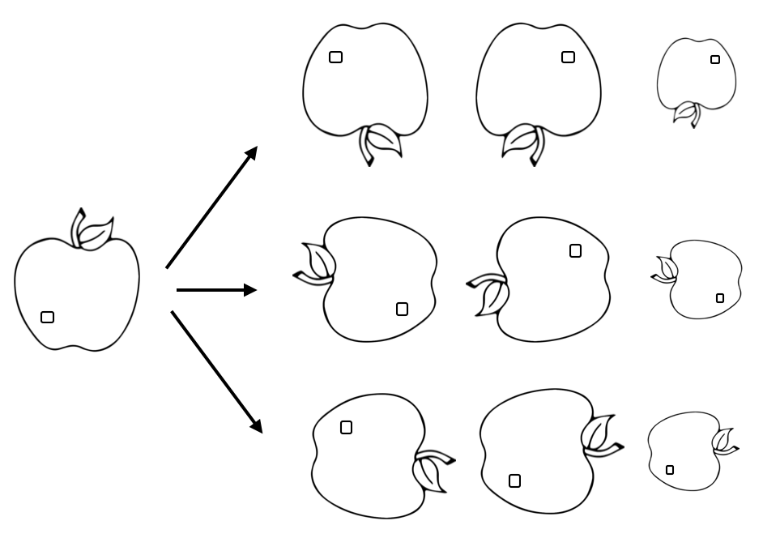

# PyTorch Workflow

### Flow

1. Library import
2. Transform
3. Dataset
4. Dataloader
5. model 
6. loss function
7. optimizer
8. *scheduler, *earlystopping
9. train
10. test

**1. Library Import **

각종 라이브러리를 불러온다. 

- Code Example

  ```python
  import torch
  import torch.nn as nn
  import torch.optim as optim
  import torch.nn.functional as F
  
  import torchvision
  import torchvision.transforms as transforms
  ```

  


**2. Transform**

데이터 전처리를 위한 transform을 정의한다. 데이터 증강 및 노이즈를 위한 변형을 준다.

{ width=50% }


pytorch를 배우다면 자연스럽게 torchvision의 transforms를 사용하게 되는데 albumentations 라는 라이브러리가 더 좋은 성능과 편의성을 준다는 의견도 있다.

- [Official torvision.transforms](https://github.com/albumentations-team/albumentations)
- [Official albumentations](https://github.com/albumentations-team/albumentations)
- [albumentations 소개](https://hoya012.github.io/blog/albumentation_tutorial/)


- Code Example 

  ```python
  transform_train = transforms.Compose([
      # transforms.RandomCrop(32, padding=4),
      # transforms.RandomHorizontalFlip(),
      transforms.ToTensor(),
      # transforms.Normalize((0.4914, 0.4822, 0.4465), (0.2023, 0.1994, 0.2010)),
  ])
  ```

  


**3.Dataset**

사용자 정의 데이터를 불러온다.


